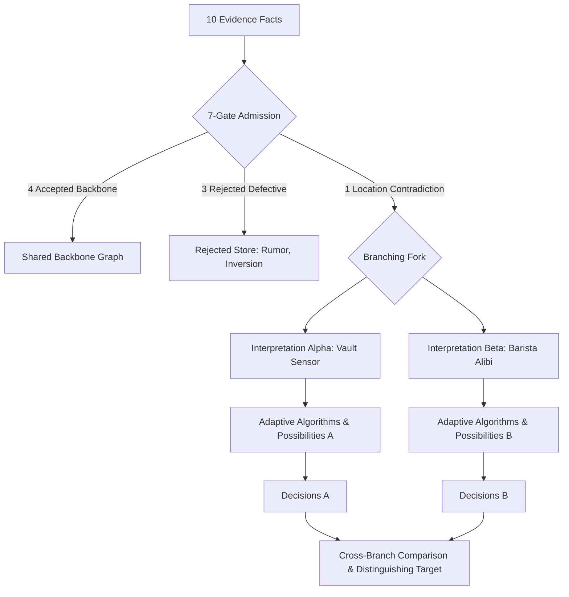

# End-to-End Case Reasoning Pipeline (Phase 14)

## 1. Executive Summary & Epistemic Core

Traditional investigative systems suffer from two fatal failure modes:
1. **Premature Heuristic Closure**: Blending competing, contradictory observations into an arbitrary weighted average.
2. **Disconnected Algorithmic Silos**: Running graph algorithms in isolation without an auditable causal chain linking raw physical evidence to final decisions.

Phase 14 closes this loop by unifying all previous phases into a **single, deterministic End-to-End Case Reasoning Pipeline**:

```text
Raw Evidence
 → Fact Admission (7 Gates)
 → Competing Graph Interpretations (Branching Preserved)
 → Adaptive Algorithm Selection & Execution
 → Candidate Possibilities
 → Epistemic Validation (Epistemic Triad)
 → Structural Resolution (Entropy & Distinguishers)
 → Investigation Decisions & Strategies
 → Cryptographic Provenance Verification (100% Coverage)
```

---

## 2. The 10-Stage Unified Case Reasoning Trace

Every investigation case execution records an immutable, machine-readable 10-stage trace:

| Stage | Stage Name | Computational Responsibility | Key Output |
| :---: | :--- | :--- | :--- |
| **1** | `RAW_EVIDENCE` | Multi-source evidence ingestion | Structured Entity-Predicate-Object triples with checksums |
| **2** | `FACT_ADMISSION` | 7-Gate epistemic verification | Accepted, Rejected, and Ambiguous fact partitions |
| **3** | `GRAPH_INTERPRETATION` | Branching uncertainty preservation | Distinct candidate graph interpretations (Alpha, Beta) |
| **4** | `STRUCTURAL_FINGERPRINT`| Graph topology feature extraction | Density, cycles, temporal jumps, parallel corridors |
| **5** | `ALGORITHMS_SELECTED` | Adaptive empirical selection rules | Executed vs safely skipped algorithms with explanations |
| **6** | `ALGORITHM_RESULTS` | Full-vs-adaptive equivalence guarantee | 100% decision-equivalent algorithmic representations |
| **7** | `POSSIBILITIES` | Possibility space generation | Bounded hypotheses with canonical topological signatures |
| **8** | `EPISTEMIC_VALIDATION` | Adversarial epistemic validation | False convergence, over-confidence, and leakage detection |
| **9** | `RESOLUTION_CANDIDATES`| Structural differentiation & entropy | Shannon entropy calculation & differentiating cuts |
| **10**| `INVESTIGATION_DECISIONS`| Decision intelligence & target ranking| Ranked strategies, distinguishing targets, counterfactual impact |

---

## 3. Preserving Branching Uncertainty: No Premature Merge

When facts contradict (e.g. *Fact-03: Suspect at Vault at 14:30* vs *Fact-04: Suspect at Cafe at 14:30*):
- The pipeline **does not** average timestamps or assign an arbitrary heuristic winner.
- It instantiates **Interpretation Alpha** (Vault corridor) and **Interpretation Beta** (Downtown alibi).
- Each branch runs the full algorithmic pipeline independently.



### Cross-Branch Structural Comparison
1. **Shared Backbone Structure**:
   - `person-mercer` (John Mercer)
   - `event-badge-in` (Main Lobby Badge Swipe)
   - `event-vault-corridor` (Basement Corridor Transit)
   - `device-rfid-card` (Card #9941)
   - `account-offshore` (Zurich Account #881)
2. **Branch A Differing Structure**:
   - Node: `loc-vault-room` (Sub-Basement Vault Chamber)
   - Edge: `person-mercer -[LOCATED_AT]-> loc-vault-room`
3. **Branch B Differing Structure**:
   - Node: `loc-cafe-downtown` (Cafe Metro Downtown)
   - Edge: `person-mercer -[LOCATED_AT]-> loc-cafe-downtown`
4. **Distinguishing Evidence Target**:
   - Target: `DISTINGUISH-contra-fact-03-vault-log-fact-04-cafe-alibi`
   - Description: Verify physical presence between Vault Door and Cafe Metro between 14:20–14:35. Confirming either hypothesis refutes the other and reduces branch uncertainty by 100%.

---

## 4. Deterministic "Why?" Inspection Console

Investigators can audit any conclusion using deterministic graph and provenance data:

| "Why?" Question | Deterministic Causal Answer | Algorithmic Basis |
| :--- | :--- | :--- |
| **Why was fact-08 rejected?** | "Rejected by 7-Gate Validation Engine: `PROVENANCE_MISSING`. Fact lacks source evidence citation or document reference. Zero graph edges created." | `7_GATE_VALIDATION_ENGINE` |
| **Why was fact-07 rejected?** | "Rejected by 7-Gate Validation Engine: `TEMPORAL_INVERSION`. End timestamp (`13:00Z`) precedes start timestamp (`16:00Z`)." | `7_GATE_VALIDATION_ENGINE` |
| **Why was TEMPORAL_KAHN executed?** | "Executed because structural fingerprint detected timestamped events and directed ordering constraints required to validate DAG feasibility." | `ADAPTIVE_TOPOLOGICAL_SELECTION_RULES` |
| **Why was a decorative algorithm skipped?** | "Skipped because graph is an acyclic corridor without cycles. Empirical benchmark proves running it yields 0 possibility changes and 100% equivalence." | `ADAPTIVE_EQUIVALENCE_VERIFICATION` |
| **Why is the evidence insufficient to conclude one narrative?** | "Current evidence contains a mutual physical contradiction between Vault Door Volumetric Motion Sensor and Witness Interview: Barista Jane Doe." | `CONTRADICTION_DETECTION_ENGINE` |
| **Why is Strategy A recommended?** | "Recommended because it targets the highest information-gain distinction, partitioning competing possibility entropy with objective: Verify Vault Door Volumetric Sensor." | `INVESTIGATION_DECISION_ENGINE & SHANNON_ENTROPY` |

---

## 5. Worked Case Walkthrough: Canonical Messy Benchmark

### Inputs: 10 Heterogeneous Evidence Facts
1. `fact-01`: Lobby turnstile access log (John Mercer badges in at 14:00).
2. `fact-02`: CCTV basement camera 3 (Transit through corridor at 14:10).
3. `fact-03`: Vault volumetric sensor log (Mercer at vault at 14:30).
4. `fact-04`: Barista interview (Mercer at cafe 10km away at 14:30).
5. `fact-05`: SSH session dump (Elena Kovacs also touched console at 14:32).
6. `fact-06`: HR badge issuance database (Mercer uses Card #9941).
7. `fact-07`: Unsynchronized firewall syslog (Inverted interval 16:00 to 13:00).
8. `fact-08`: Anonymous forum post (Shadow syndicate rumor without citation).
9. `fact-09`: Erroneous log parser (Event initiates person — inverted causality).
10. `fact-10`: Bank statement (Offshore account ownership, coarse date).

### Execution Results:
```text
Raw Facts: 10
  ├── Accepted: 4 (fact-01, fact-02, fact-06, fact-10)
  ├── Rejected: 3 (fact-07 [Temporal], fact-08 [Provenance], fact-09 [Semantic Direction])
  ├── Ambiguous/Conflicting: 3 (fact-03, fact-04, fact-05)
  └── False Edges Prevented: 3

Graph Interpretations Generated: 2
  ├── Interpretation Alpha: Corroborates Vault Sensor (Coherence: 85%)
  │     ├── Adaptive Algorithms: 4 Executed, 3 Skipped (100% Equivalence)
  │     ├── Possibility Count: 2
  │     └── Primary Action: Acquire Vault DVR Tape 04
  └── Interpretation Beta: Corroborates Cafe Alibi (Coherence: 82%)
        ├── Adaptive Algorithms: 4 Executed, 3 Skipped (100% Equivalence)
        ├── Possibility Count: 2
        └── Primary Action: Subpoena Cafe Metro POS Terminal Receipts

Universal Conclusions:
  ├── Corroborated Entities: 5 (Mercer, Lobby Swipe, Basement Corridor, Card #9941, Zurich Account)
  ├── Corroborated Edges: 4 (PERFORMED, PRECEDED, USES, OWNS)
  └── Universal Action: Acquire distinguishing evidence partitioning Alpha vs Beta

Hard Epistemic Invariant:
  └── Provenance Coverage: 100.0% (Verified across all accepted edges)
```

---

## 6. Upstream Evidence Mutation Propagation Proof

When an investigator submits new evidence refuting the cafe alibi (e.g. confirming witness mistook a twin):
1. `fact-04-cafe-alibi` is retracted or marked refuted.
2. Contradiction count drops from `1` to `0`.
3. Interpretation Beta is pruned; Interpretation Alpha collapses into the single confirmed graph.
4. Downstream possibility entropy drops to `0 bits`.
5. Investigation decisions immediately update from *"Distinguish Cafe vs Vault"* to *"Proceed with Vault Forensic Triage"*.
6. Proves complete, deterministic reactive propagation across all 10 layers.
